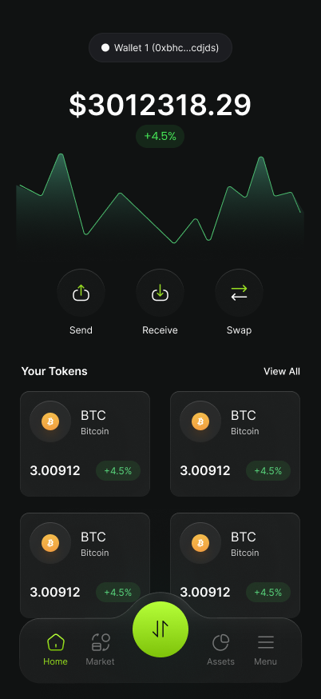

# 🚀 Easy Wallet – Simplifying Crypto for Everyone
### [Hackathon project at ETH GLOBAL PRAGUE]
### Preview: https://ethglobal.com/showcase/easywallet-x4rj5 

## 🧠 Overview
Easy Wallet is your go-to gateway into the world of crypto and blockchain. Designed specifically for newcomers, Easy Wallet demystifies the complexity of cryptocurrencies by offering an intuitive, educational, and analytic experience — all within a sleek, beginner-friendly interface.

Whether you're exploring your first token or making your first swap, Easy Wallet simplifies every step with:

- 📊 **AI-Powered Token Insights:** Leveraging cutting-edge AI, Easy Wallet provides essential metrics like price, liquidity, and risk assessment — all presented in a clean, digestible format designed for newcomers.
- 📚 **Smart Educational Guidance:** AI-driven learning modules offer tailored explanations, contextual tips, and interactive visuals to reinforce confidence in crypto exploration.
- 🔄 **1-Click Token Swapping:** Powered by the 1inch API, Easy Wallet intelligently optimizes swap routes, gas fees, and slippage to ensure the best possible trade execution.

## 🔥 Features

### 🔍 AI-Enhanced Token Discovery & Insights
- Real-time market analytics (price, volume, trend)
- AI-assisted risk assessment and recommendations

### 💱 One-Click Token Swapping
- Powered by the robust 1inch API

### 📖 Education
- Intelligent tooltips, glossary terms, and quick guides
- Adaptive risk analysis designed to reinforce user confidence and independence

## 🛠️ Tech Stack:
- **Frontend:** React
- **Backend:** FastAPI
- **AI & Data Processing:** OpenAI SDK
- **Blockchain & Trading APIs:** 1Inch, Moralis, CoinMarket

## 🔐 Security
Easy Wallet never stores user private keys or wallet data. All swaps are executed directly via users' connected wallets, ensuring full custody and transparency. The AI-driven security framework continuously analyzes risk factors to alert users of potential threats, enhancing safe trading and asset management.

## 🎥 Sample preview
Explore a preview of Easy Wallet’s user interface and core functionality:

## Authors:
* https://github.com/Jzackiewicz
* https://github.com/pyciu123
* https://github.com/dszafran
* https://github.com/maciejwiacek
* https://github.com/bobbyskywalker